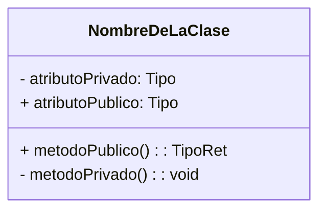
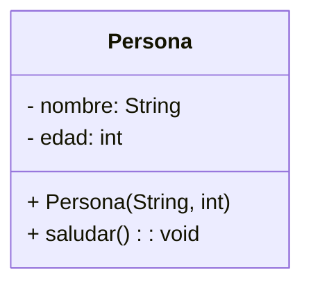
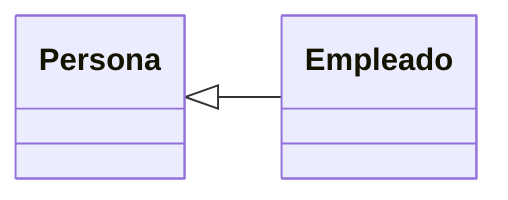
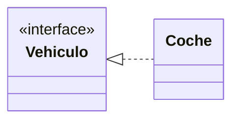
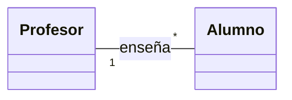
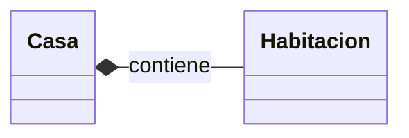
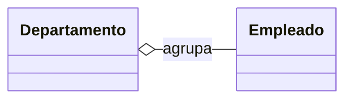
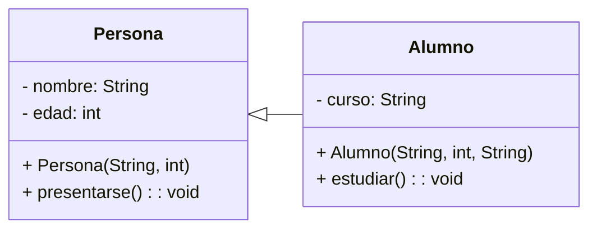

# Capítulo 1 — Representación gráfica de clases y objetos en UML

## 1.1. Qué es UML y para qué se utiliza

**UML** (Unified Modeling Language) es un lenguaje de modelado estándar utilizado en ingeniería del software para representar, de forma visual, la estructura y el comportamiento de los sistemas orientados a objetos.

En el contexto de Java, UML permite **visualizar la estructura de las clases, sus atributos, métodos y relaciones**, facilitando la comprensión del diseño antes de escribir el código.

UML no es un lenguaje de programación, sino una **herramienta de diseño y comunicación** que ayuda a representar los componentes del sistema y sus interacciones.

---

## 1.2. Representación de una clase en UML

En UML, una **clase** se representa mediante un **rectángulo dividido en tres secciones**:


<div class="diagram-block" align="center">

</div>


**Convenciones:**
- `+` indica **visibilidad pública** (`public`)
- `-` indica **visibilidad privada** (`private`)
- `#` indica **visibilidad protegida** (`protected`)
- Los tipos se escriben después de los dos puntos `:`
- Los métodos se representan con sus paréntesis y el tipo de retorno

---

### Ejemplo en Java

```java
public class Persona {
    private String nombre;
    private int edad;

    public Persona(String nombre, int edad) {
        this.nombre = nombre;
        this.edad = edad;
    }

    public void saludar() {
        System.out.println("Hola, me llamo " + nombre);
    }
}
```

**Representación UML:**


<div class="diagram-block" align="center">

</div>


---

## 1.3. Visibilidad de atributos y métodos

| Símbolo | Tipo de acceso | Palabra clave en Java | Accesible desde |
|:--------:|:----------------|:----------------------|:----------------|
| `+` | Público | `public` | Cualquier clase |
| `-` | Privado | `private` | Solo dentro de la misma clase |
| `#` | Protegido | `protected` | Subclases o clases del mismo paquete |
| *(sin símbolo)* | Paquete (por defecto) | *(sin modificador)* | Clases del mismo paquete |

---

## 1.4. Relaciones entre clases

En UML, las relaciones representan la forma en que las clases interactúan o dependen unas de otras.  
Las más comunes en Java son:

### 1.4.1. Herencia (`extends`)

Representa una **relación "es un"**.  
Se dibuja con una **flecha con punta triangular** desde la subclase hacia la superclase.

**Ejemplo UML:**


<div class="diagram-block" align="center">

</div>


**Ejemplo Java:**
```java
public class Empleado extends Persona {
    private double salario;
}
```

---

### 1.4.2. Implementación de interfaces (`implements`)

Representa una **relación de contrato**.  
Se dibuja con una **línea discontinua con triángulo blanco** desde la clase hacia la interfaz.


<div class="diagram-block" align="center">

</div>


```java
public class Coche implements Vehiculo {
    public void arrancar() { ... }
}
```

---

### 1.4.3. Asociación

Representa una **relación directa** entre dos clases, donde una conoce o utiliza a la otra.  
Se dibuja con una **línea simple**, opcionalmente con multiplicidad en los extremos:


<div class="diagram-block" align="center">

</div>

Esto significa que un profesor puede tener varios alumnos.

```java
public class Profesor {
    private List<Alumno> alumnos;
}
```

---

### 1.4.4. Composición y agregación

Ambas representan relaciones **"tiene un"**, pero con diferente nivel de dependencia.

#### Composición
- El objeto contenido **no puede existir sin** el contenedor.  
- Se dibuja con un **rombo negro**.


<div class="diagram-block" align="center">

</div>


```java
public class Casa {
    private Habitacion habitacion = new Habitacion();
}
```

#### Agregación
- El objeto contenido puede existir independientemente.  
- Se dibuja con un **rombo blanco**.


<div class="diagram-block" align="center">

</div>


```java
public class Departamento {
    private List<Empleado> empleados;
}
```

---

## 1.5. Ejemplo completo: diagrama UML de `Persona` y `Alumno`

### Código Java

```java
public class Persona {
    private String nombre;
    private int edad;

    public Persona(String nombre, int edad) {
        this.nombre = nombre;
        this.edad = edad;
    }

    public void presentarse() {
        System.out.println("Soy " + nombre + " y tengo " + edad + " años.");
    }
}

public class Alumno extends Persona {
    private String curso;

    public Alumno(String nombre, int edad, String curso) {
        super(nombre, edad);
        this.curso = curso;
    }

    public void estudiar() {
        System.out.println(nombre + " está estudiando " + curso);
    }
}
```

### Diagrama UML


<div class="diagram-block" align="center">

</div>


---

## 1.6. Resumen

- UML permite representar visualmente las clases y sus relaciones.  
- Facilita la comprensión y el mantenimiento del código.  
- Los diagramas de clases son una herramienta clave antes de programar.  
- Las principales relaciones en Java (herencia, asociación, agregación y composición) se expresan directamente en UML.

