# Capítulo 17 — Patrones de diseño

Este capítulo presenta los principales **patrones de diseño** usados en aplicaciones Java modernas, organizados por categorías, con **diagramas UML (Mermaid)** y **ejemplos de código**. Los diagramas muestran clases y **métodos clave** para entender la colaboración entre componentes.

---

## 17.1. Clasificación general

- **Creacionales**: controlan la creación de objetos (Singleton, Factory Method, Abstract Factory).  
- **Estructurales**: organizan clases/objetos para formar estructuras más grandes (Adapter, Facade, Decorator).  
- **De comportamiento**: definen cómo interactúan y se reparten responsabilidades (Iterator, Observer, Command, DAO, MVC).

> Nota: **DAO** y **MVC** no forman parte de los 23 patrones GoF, pero son patrones arquitectónicos ampliamente aceptados y usados en Java. DAO enlaza con JDBC (Cap. 16).

---

## 17.2. Patrones creacionales

### 17.2.1. Singleton

**Propósito**: Garantizar que exista **una única instancia** y un **punto global de acceso**.  
**Cuándo usar**: Configuración global, *pools* de conexiones, *cache* compartida.

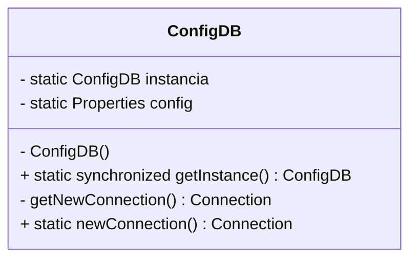

**Implementación (reutiliza el ejemplo del Cap. 16):**

```java
public class ConfigDB {
    private static ConfigDB instancia;
    private static Properties config = new Properties();

    private ConfigDB() { /* carga de propiedades */ }

    public static synchronized ConfigDB getInstance() {
        if (instancia == null) instancia = new ConfigDB();
        return instancia;
    }

    private Connection getNewConnection() throws SQLException { /* ... */ }

    public static Connection newConnection() throws SQLException {
        return getInstance().getNewConnection();
    }
}
```

**Ventajas**: control centralizado, inicialización perezosa si interesa.  
**Riesgos**: acoplamiento global, dificultad para pruebas (considerar inyección de dependencias).

---

### 17.2.2. Factory Method

**Propósito**: Delegar la **creación de objetos** a subclases, encapsulando la lógica de construcción.

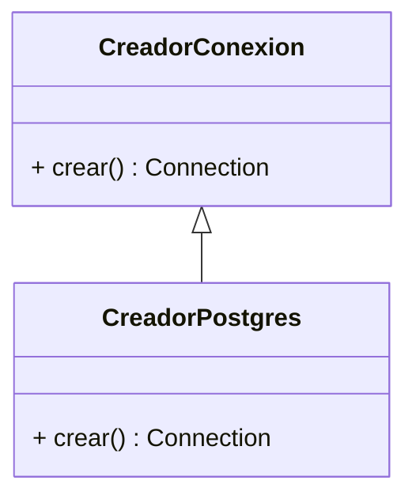

**Ejemplo:**

```java
abstract class CreadorConexion {
    public abstract Connection crear() throws SQLException;
}

class CreadorPostgres extends CreadorConexion {
    @Override
    public Connection crear() throws SQLException {
        return ConfigDB.newConnection();
    }
}
```

---

### 17.2.3. Abstract Factory

**Propósito**: Crear **familias de objetos relacionados** sin especificar sus clases concretas.

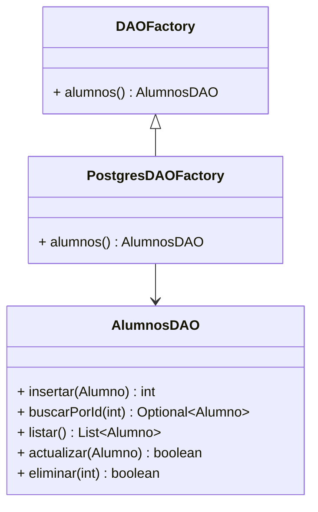

**Ejemplo mínimo:**

```java
interface DAOFactory {
    AlumnosDAO alumnos();
}
class PostgresDAOFactory implements DAOFactory {
    public AlumnosDAO alumnos() { return new AlumnosDAOPostgres(); }
}
```

---

## 17.3. Patrones estructurales

### 17.3.1. Adapter (a.k.a. Plugin / Wrapper)

**Propósito**: **Adaptar** una interfaz existente a la que espera el cliente, sin cambiar el código del cliente.

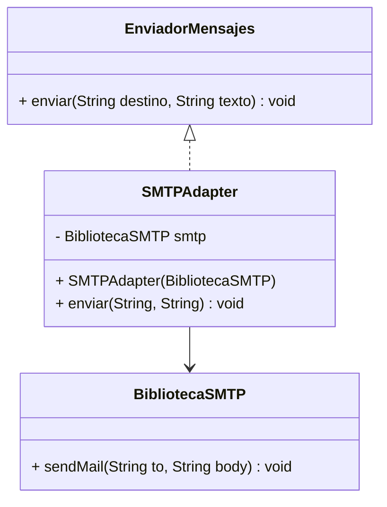

**Ejemplo:**

```java
interface EnviadorMensajes { void enviar(String destino, String texto); }

class BibliotecaSMTP { void sendMail(String to, String body) { /* ... */ } }

class SMTPAdapter implements EnviadorMensajes {
    private final BibliotecaSMTP smtp;
    SMTPAdapter(BibliotecaSMTP smtp) { this.smtp = smtp; }
    public void enviar(String destino, String texto) { smtp.sendMail(destino, texto); }
}
```

---

### 17.3.2. Facade

**Propósito**: Ofrecer una **interfaz unificada y simple** a un subsistema complejo.

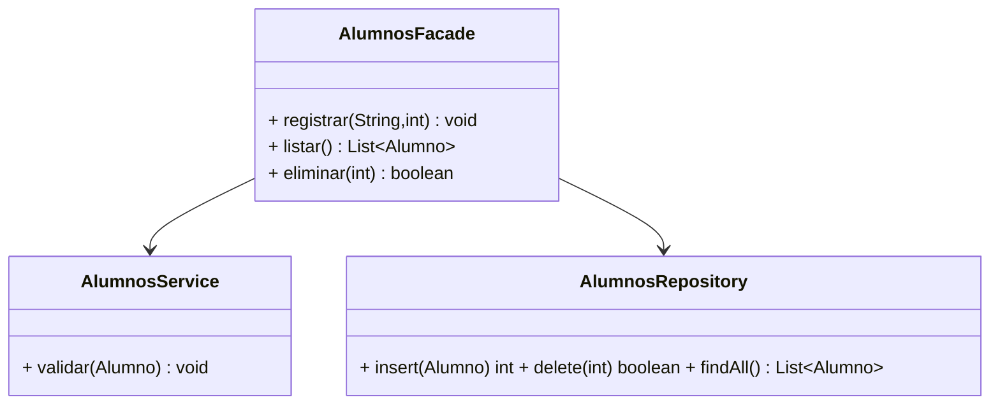

**Ejemplo:**

```java
class AlumnosFacade {
    private final AlumnosService service = new AlumnosService();
    private final AlumnosRepository repo = new AlumnosRepository();
    public void registrar(String nombre, int edad){ /* validar y guardar */ }
    public List<Alumno> listar(){ return repo.findAll(); }
    public boolean eliminar(int id){ return repo.delete(id); }
}
```

---

### 17.3.3. Decorator

**Propósito**: Añadir responsabilidades **dinámicamente** a un objeto sin modificar su clase.

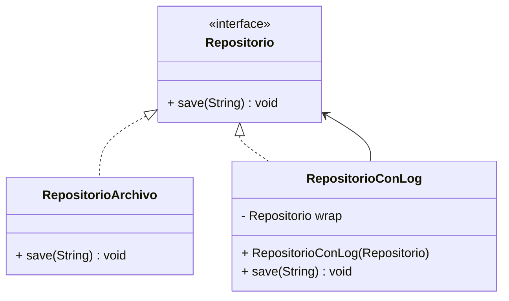

**Ejemplo:**

```java
interface Repositorio { void save(String dato); }

class RepositorioArchivo implements Repositorio {
    public void save(String dato) { /* guarda en archivo */ }
}

class RepositorioConLog implements Repositorio {
    private final Repositorio wrap;
    RepositorioConLog(Repositorio wrap) { this.wrap = wrap; }
    public void save(String dato) {
        System.out.println("LOG: guardando " + dato);
        wrap.save(dato);
    }
}
```

---

## 17.4. Patrones de comportamiento

### 17.4.1. Iterator

**Propósito**: Proporcionar una forma de **recorrer** elementos de una colección sin exponer su representación interna.

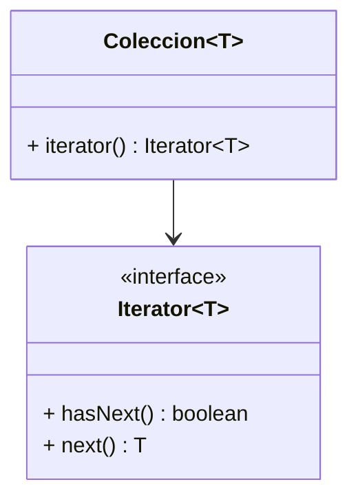

**Ejemplo (uso estándar en Java):**

```java
List<String> lista = List.of("A", "B", "C");
Iterator<String> it = lista.iterator();
while (it.hasNext()) System.out.println(it.next());
```

---

### 17.4.2. Observer

**Propósito**: Definir una **dependencia uno-a-muchos**: cuando el sujeto cambia, **notifica** a sus observadores.

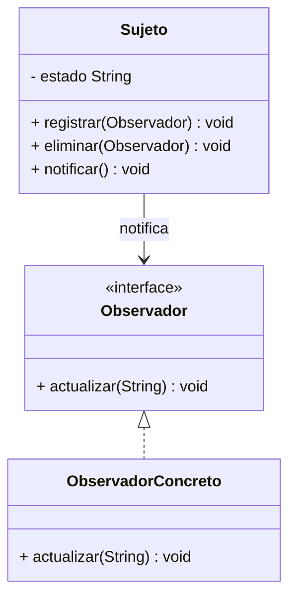

**Ejemplo:**

```java
interface Observador { void actualizar(String estado); }

class Sujeto {
    private final List<Observador> obs = new ArrayList<>();
    private String estado;
    void setEstado(String e){ estado = e; notificar(); }
    void registrar(Observador o){ obs.add(o); }
    void eliminar(Observador o){ obs.remove(o); }
    void notificar(){ obs.forEach(o -> o.actualizar(estado)); }
}
```

---

### 17.4.3. Command

**Propósito**: Encapsular una **petición** como objeto, parametrizando clientes con colas, *logs* y deshacer/rehacer.

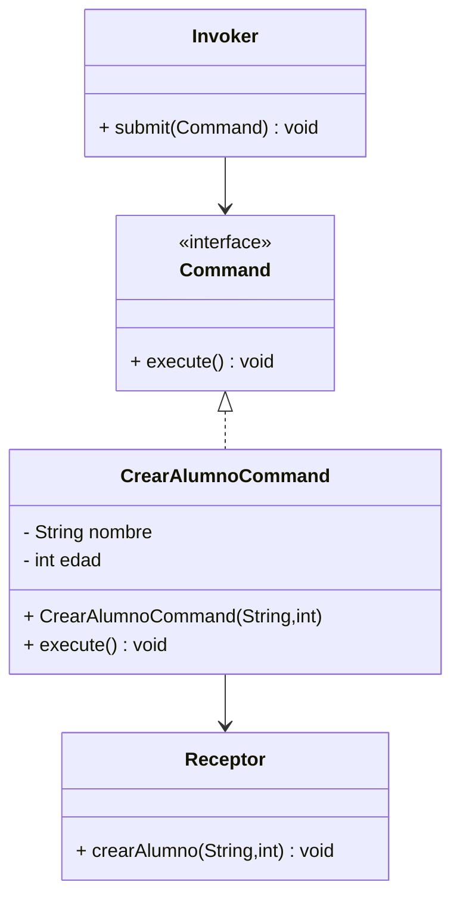

**Ejemplo:**

```java
interface Command { void execute(); }

class Receptor {
    void crearAlumno(String nombre, int edad){ /* inserta en BD */ }
}

class CrearAlumnoCommand implements Command {
    private final Receptor receptor; private final String nombre; private final int edad;
    CrearAlumnoCommand(Receptor r, String n, int e){ receptor=r; nombre=n; edad=e; }
    public void execute(){ receptor.crearAlumno(nombre, edad); }
}
```

---

### 17.4.4. DAO (Data Access Object)

**Propósito**: Separar la **lógica de acceso a datos** de la lógica de negocio.  
**Contexto**: Reutiliza la tabla `alumnos` del Cap. 16.

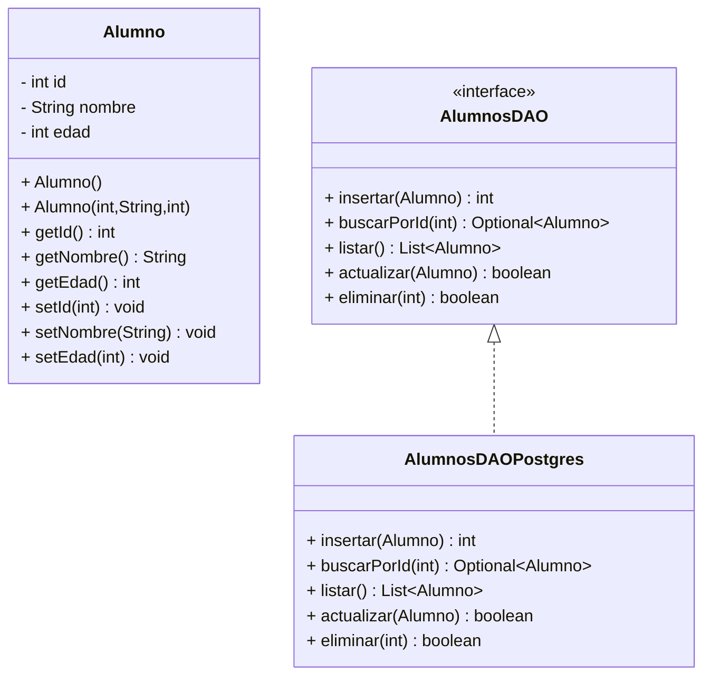

**Implementación (resumen):**

```java
public interface AlumnosDAO {
    int insertar(Alumno a) throws SQLException;
    Optional<Alumno> buscarPorId(int id) throws SQLException;
    List<Alumno> listar() throws SQLException;
    boolean actualizar(Alumno a) throws SQLException;
    boolean eliminar(int id) throws SQLException;
}

public class AlumnosDAOPostgres implements AlumnosDAO {
    public int insertar(Alumno a) throws SQLException {
        String sql = "INSERT INTO alumnos (nombre, edad) VALUES (?, ?) RETURNING id";
        try (Connection c = ConfigDB.newConnection();
             PreparedStatement ps = c.prepareStatement(sql)) {
            ps.setString(1, a.getNombre());
            ps.setInt(2, a.getEdad());
            try (ResultSet rs = ps.executeQuery()) {
                return rs.next() ? rs.getInt(1) : -1;
            }
        }
    }
    // resto de métodos similares
}
```

**Ventajas**: desacopla persistencia, facilita *mocking* y pruebas, intercambia motor BD.  
**Relación**: puede combinarse con **Factory** / **Abstract Factory** para seleccionar implementaciones.

---

### 17.4.5. MVC (Modelo–Vista–Controlador)

**Propósito**: Separar **modelo de datos**, **presentación** y **control de flujo**.  
**Uso**: Aplicaciones de escritorio, web y móviles.

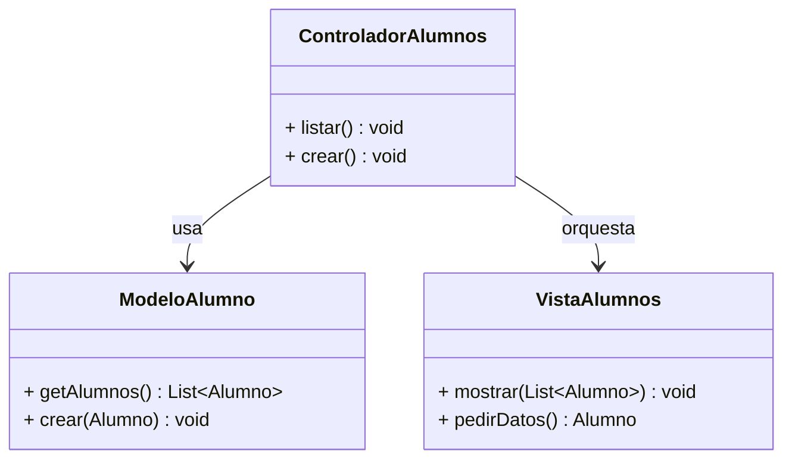

**Esqueleto Java (console):**

```java
class ModeloAlumno {
    private final AlumnosDAO dao = new AlumnosDAOPostgres();
    List<Alumno> getAlumnos() throws SQLException { return dao.listar(); }
    void crear(Alumno a) throws SQLException { dao.insertar(a); }
}

class VistaAlumnos {
    void mostrar(List<Alumno> datos){ datos.forEach(System.out::println); }
    Alumno pedirDatos(){ return new Alumno(0, "Ana", 22); } // ejemplo
}

class ControladorAlumnos {
    private final ModeloAlumno modelo = new ModeloAlumno();
    private final VistaAlumnos vista = new VistaAlumnos();
    void listar() throws Exception { vista.mostrar(modelo.getAlumnos()); }
    void crear() throws Exception { modelo.crear(vista.pedirDatos()); }
}
```

**Ventajas**: desacopla capas, facilita pruebas y cambios en la UI.  
**Relación**: en aplicaciones web, el Controlador suele ser un *controller* HTTP y la Vista una plantilla/HTML.

---

## 17.5. Resumen y buenas prácticas

- Selecciona el patrón por su **problema/coste–beneficio**, no por moda.  
- Mantén el **acoplamiento bajo** y la **cohesión alta**.  
- Combina patrones cuando aporten claridad (DAO + Factory, Facade + Decorator).  
- Documenta con diagramas y ejemplos mínimos verificables.
