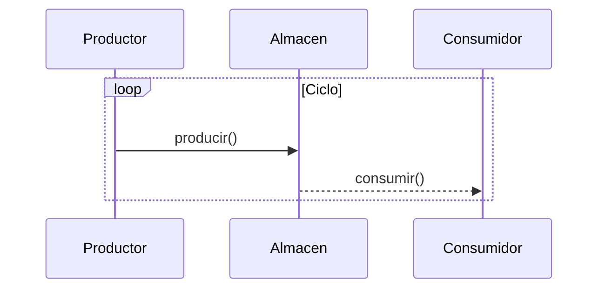
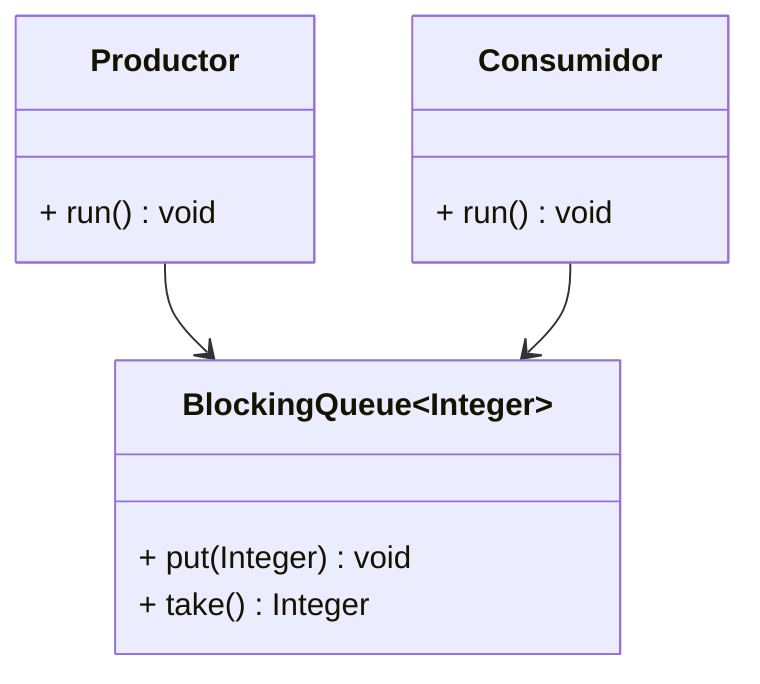

# Capítulo 18 — Hilos y concurrencia en Java

Java permite la **ejecución concurrente** de tareas mediante **hilos (threads)**.  
Un hilo es una unidad ligera de ejecución dentro de un proceso.  
Todos los programas Java comienzan con al menos un hilo: el **hilo principal (`main`)**.

---

## 18.1. Conceptos básicos

- **Proceso**: programa en ejecución con su propia memoria.  
- **Hilo (Thread)**: subproceso que comparte los recursos del proceso.  
- **Concurrencia**: múltiples tareas que progresan *simultáneamente* (aunque no necesariamente al mismo tiempo).  
- **Paralelismo**: ejecución real en paralelo en múltiples núcleos.

---

## 18.2. Ciclo de vida de un hilo

```
NEW → RUNNABLE → RUNNING → BLOCKED/WAITING → TERMINATED
```

1. **NEW**: creado pero no iniciado.  
2. **RUNNABLE**: listo para ejecutarse.  
3. **RUNNING**: en ejecución.  
4. **WAITING/BLOCKED**: detenido temporalmente.  
5. **TERMINATED**: finalizado.

---

## 18.3. Crear hilos en Java

### 1. Extendiendo la clase `Thread`

```java
class MiHilo extends Thread {
    public void run() {
        for (int i = 0; i < 3; i++)
            System.out.println(getName() + " ejecutando: " + i);
    }
}

public class Ejemplo1 {
    public static void main(String[] args) {
        new MiHilo().start();
        new MiHilo().start();
    }
}
```

### 2. Implementando la interfaz `Runnable`

```java
class Tarea implements Runnable {
    public void run() {
        System.out.println(Thread.currentThread().getName() + " en ejecución.");
    }
}

public class Ejemplo2 {
    public static void main(String[] args) {
        Thread t = new Thread(new Tarea(), "Hilo-1");
        t.start();
    }
}
```

---

## 18.4. Métodos comunes de `Thread`

| Método | Descripción |
|--------|--------------|
| `start()` | Inicia la ejecución del hilo (llama a `run()`). |
| `sleep(ms)` | Suspende temporalmente la ejecución. |
| `join()` | Espera a que otro hilo termine. |
| `setPriority(int)` | Cambia la prioridad del hilo (1–10). |
| `interrupt()` | Señala una interrupción al hilo. |
| `isAlive()` | Comprueba si sigue en ejecución. |

---

## 18.5. Sincronización

Cuando varios hilos acceden a **recursos compartidos**, pueden producirse **condiciones de carrera**.  
Para evitarlo se usa la palabra clave `synchronized`.

### Ejemplo

```java
class Contador {
    private int valor = 0;

    public synchronized void incrementar() {
        valor++;
    }

    public int getValor() { return valor; }
}
```

---

## 18.6. Comunicación entre hilos con `wait()` y `notify()`

Los métodos `wait()`, `notify()` y `notifyAll()` permiten coordinar hilos que comparten recursos.

### Ejemplo simple

```java
class Almacen {
    private boolean disponible = false;
    private int dato;

    public synchronized void producir(int valor) throws InterruptedException {
        while (disponible) wait();
        dato = valor;
        disponible = true;
        System.out.println("Producido: " + valor);
        notify();
    }

    public synchronized int consumir() throws InterruptedException {
        while (!disponible) wait();
        disponible = false;
        System.out.println("Consumido: " + dato);
        notify();
        return dato;
    }
}
```

---

## 18.7. Patrón Productor–Consumidor (versión manual)

### Diagrama conceptual



### Código completo

```java
class Productor extends Thread {
    private Almacen almacen;

    Productor(Almacen a) { almacen = a; }

    public void run() {
        for (int i = 1; i <= 5; i++) {
            try {
                almacen.producir(i);
                Thread.sleep(500);
            } catch (InterruptedException e) { e.printStackTrace(); }
        }
    }
}

class Consumidor extends Thread {
    private Almacen almacen;

    Consumidor(Almacen a) { almacen = a; }

    public void run() {
        for (int i = 1; i <= 5; i++) {
            try {
                almacen.consumir();
                Thread.sleep(800);
            } catch (InterruptedException e) { e.printStackTrace(); }
        }
    }
}

public class ProductorConsumidorManual {
    public static void main(String[] args) {
        Almacen almacen = new Almacen();
        new Productor(almacen).start();
        new Consumidor(almacen).start();
    }
}
```

---

## 18.8. Patrón Productor–Consumidor con `BlockingQueue`

El paquete `java.util.concurrent` ofrece estructuras **seguras para hilos**, como `BlockingQueue`, que simplifican la sincronización.

### Diagrama conceptual



### Código

```java
import java.util.concurrent.*;

class ProductorBQ implements Runnable {
    private final BlockingQueue<Integer> cola;
    ProductorBQ(BlockingQueue<Integer> c) { cola = c; }

    public void run() {
        try {
            for (int i = 1; i <= 5; i++) {
                cola.put(i);
                System.out.println("Producido: " + i);
                Thread.sleep(400);
            }
            cola.put(-1); // señal de fin
        } catch (InterruptedException e) { Thread.currentThread().interrupt(); }
    }
}

class ConsumidorBQ implements Runnable {
    private final BlockingQueue<Integer> cola;
    ConsumidorBQ(BlockingQueue<Integer> c) { cola = c; }

    public void run() {
        try {
            Integer valor;
            while ((valor = cola.take()) != -1) {
                System.out.println("Consumido: " + valor);
                Thread.sleep(600);
            }
        } catch (InterruptedException e) { Thread.currentThread().interrupt(); }
    }
}

public class ProductorConsumidorBQ {
    public static void main(String[] args) {
        BlockingQueue<Integer> cola = new ArrayBlockingQueue<>(3);
        new Thread(new ProductorBQ(cola)).start();
        new Thread(new ConsumidorBQ(cola)).start();
    }
}
```

---

## 18.9. Ejecución de tareas con `ExecutorService`

`ExecutorService` simplifica la gestión de hilos mediante un **pool de hilos reutilizables**.

```java
import java.util.concurrent.*;

public class EjemploExecutor {
    public static void main(String[] args) throws InterruptedException {
        ExecutorService ejecutor = Executors.newFixedThreadPool(2);

        Runnable tarea = () -> {
            String hilo = Thread.currentThread().getName();
            System.out.println("Ejecutando en: " + hilo);
        };

        for (int i = 0; i < 4; i++) ejecutor.submit(tarea);

        ejecutor.shutdown();
        ejecutor.awaitTermination(5, TimeUnit.SECONDS);
    }
}
```

---

## 18.10. Buenas prácticas en programación concurrente

- Evitar sincronización innecesaria.  
- Usar estructuras de `java.util.concurrent` en lugar de sincronización manual.  
- Preferir `ExecutorService` sobre crear hilos directamente.  
- Proteger secciones críticas con `synchronized` o `Lock`.  
- Usar `volatile` solo cuando sea necesario (lecturas concurrentes).  
- Siempre finalizar correctamente los hilos (`shutdown()`, `join()`).

---

## 18.11. Resumen

- Los hilos permiten ejecutar tareas concurrentes dentro de un mismo proceso.  
- `Runnable` separa la lógica de la ejecución del hilo.  
- La sincronización evita condiciones de carrera.  
- `wait()`/`notify()` permiten coordinación manual, pero `BlockingQueue` simplifica la implementación.  
- `ExecutorService` gestiona grupos de hilos de manera eficiente.  
- La concurrencia debe manejarse con cuidado para evitar bloqueos y errores difíciles de depurar.
